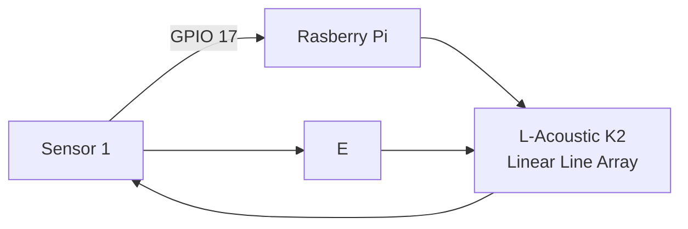
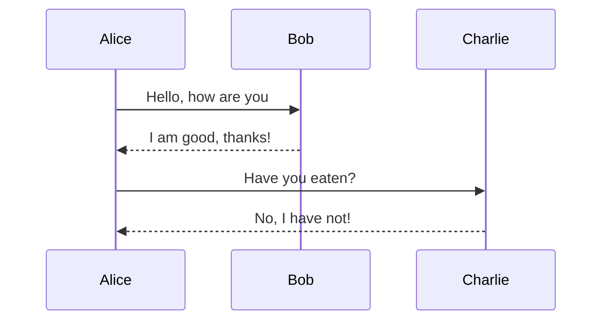

# Headers
This is for **heading 1**.

## Heading 2
This is for *heading 2*.

### Heading 3
This is for ***heading 3***.

# List
This is how you list items in markdown. 
1. Member 1
    * Team Leader
        * Project Owner
2. Member 2
    * Hardware
3. Member 3
    * Software
3. Member 4
    * Cheer Leader

# Inserting an Image
 To insert an image, you will need to drag+hold shift+drop

 [Click here to link](https://www.google.com)

 [Click here to jump to test.md](/test.md)

 # Code block
 To highlight or insert a particular section of code, you can do the following
 1. In rasberry pi, if you want to update you will `sudo-apt-update`

 ```
 from tkinter import *
 
 main=Tk()

 main.mainloop()
 ```

 # Quotes
A famous quote by **Sir Isaac Newton**
>For every action, there will be a reaction.

# Tables

This is how you insert tables
|Header A||Header B||Header C|
|-------:|----------:|-------|
|Row 1| Data A| Data B|
|Row 2|                       Data C|Data D|

```
|------:| this is to justify right

```
# Horizontal Rule
This is how you insert a section line

---

# Flowchart


# Sequence Diagram




